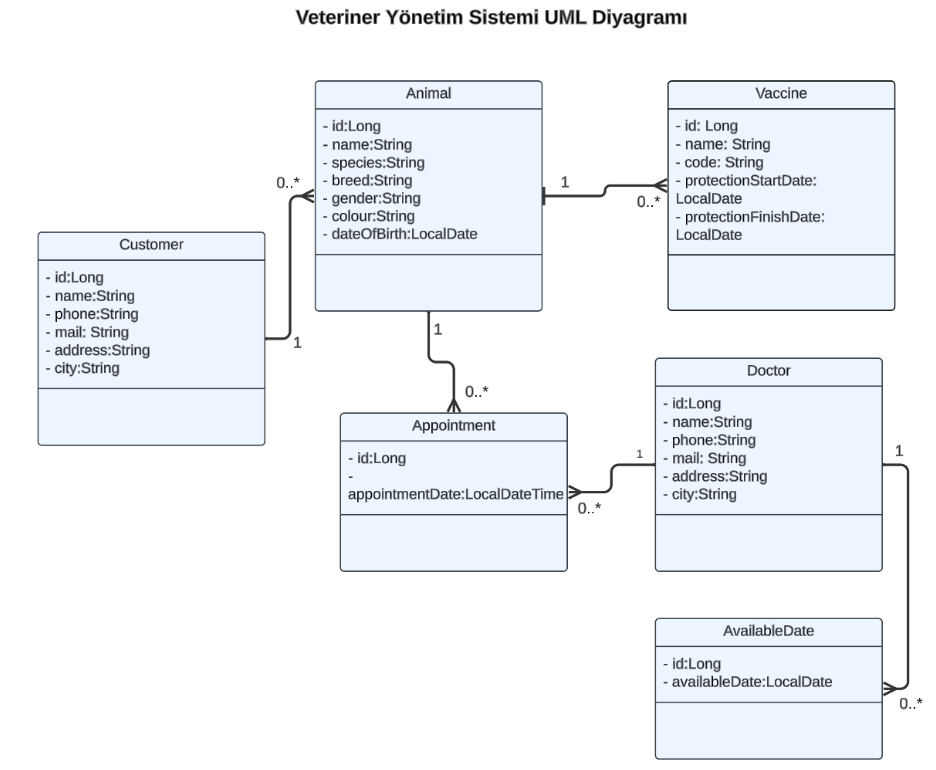

# Vet-App

This project is a backend service for veterinary applications.
The UML Diagram is as follows.



## Technologies Used

- Java 21
- Spring Boot 3
- MySQL
- Maven
- Docker
- Swagger
- Lombok
- Mapstruct
- Flyway
- RsqlFilter  [rsql-jpa-specification
  ](https://github.com/perplexhub/rsql-jpa-specification)

## Running

The project has 2 different profiles. These are development and production.
In the development profile, the back-end does not run in docker, while in the production profile, the back-end runs in
docker.

You can raise the application in docker by choosing between {dev/prod} in the command below.

If the dev profile is selected and the back-end is to be raised in our local,
The dev should be selected in the Active profiles tab.

``` dockerfile
docker compose --profile {dev/prod} up -d --build
```

## Sample Database

Flyway was used for the sample database and when the application first gets up Sample data will be migrated
automatically.

## Sample Curl With RsqlFilter

```
curl -X 'GET' \
'http://localhost:8080/api/v1/appointment?filter=doctor.id%3D%3D0311cde6-d6b6-41de-a6c4-9c40a007dbd9%3BappointmentDate%3E2023-12-31T03%3A00%3A00%3BappointmentDate%3C2024-12-31T03%3A00%3A00' \
  -H 'accept: */*'
```

FAQ [rsql-jpa-specification](https://github.com/perplexhub/rsql-jpa-specification)

With the curl request above, you can get appointments with doctor id 0311cde6-d6b6-41de-a6c4-9c40a007dbd9 and
appointmentDate between 2023-12-31T03:00:00 and 2024-12-31T03:00:00.